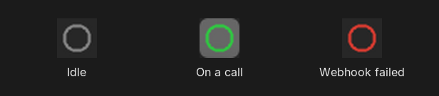
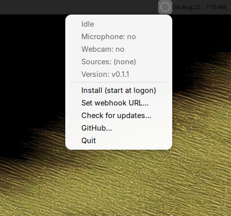
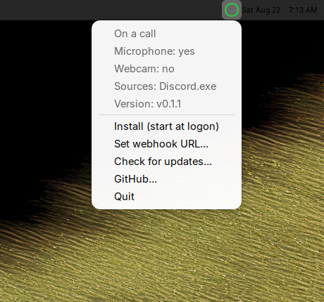
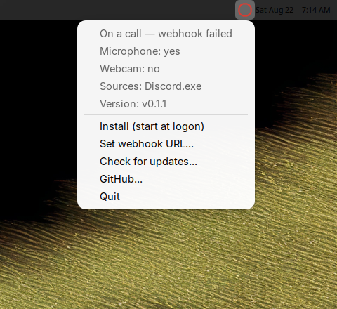
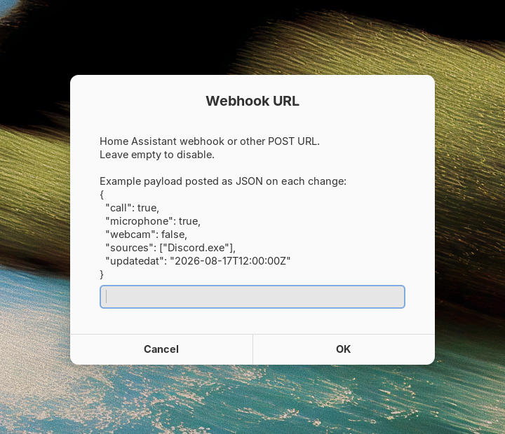

# call-detect

A small background program for **Windows**, **macOS**, and **Linux** that notices when an app is using the **microphone** or **webcam** and can POST a JSON webhook when the state changes. All three show a tray / menu-bar icon with the same actions.

It does not talk to Discord, Zoom, or any other app by name. It reads OS device-in-use signals, so it works with current and future programs — including a browser preview that uses the webcam with no microphone.

## What it reports

| Field | Meaning |
|-------|---------|
| `call` | Microphone **or** webcam is in use |
| `microphone` | Microphone is in use |
| `webcam` | Webcam is in use |
| `sources` | Short names of apps that currently hold a device |
| `updated_at` | When that snapshot was published |

Speaker or headset **playback** (music, videos) does not count. Game voice chat does, because the microphone has an active capture session.

State is debounced for about two seconds so a brief device grab does not flicker the tray icon or the webhook.

## Privacy

call-detect only **reads** OS “device in use” metadata (see [How detection works](#how-detection-works)). It does not open, record, or stream the microphone or camera. There is no telemetry. The webhook is optional and off by default. When you set a URL, each POST is the same JSON as `status.json`, including `sources` (short process or device names such as `Discord.exe`).

## Disclaimer

This software is provided **as is**, without warranty of any kind. You download, install, and run it **at your own risk**. The authors are not responsible for missed or false detections, webhook deliveries, or any other damage or loss from using it. See the [MIT License](LICENSE).

## Install

Download a binary from the newest [release](https://github.com/scallister/call-detect/releases/latest):

| OS | Download |
|----|----------|
| Windows amd64 | **[call-detect.exe](https://github.com/scallister/call-detect/releases/latest/download/call-detect.exe)** |
| Linux amd64 | **[call-detect-linux-amd64](https://github.com/scallister/call-detect/releases/latest/download/call-detect-linux-amd64)** |
| Linux arm64 | **[call-detect-linux-arm64](https://github.com/scallister/call-detect/releases/latest/download/call-detect-linux-arm64)** |
| macOS Apple silicon | **[call-detect-darwin-arm64](https://github.com/scallister/call-detect/releases/latest/download/call-detect-darwin-arm64)** |
| macOS Intel | **[call-detect-darwin-amd64](https://github.com/scallister/call-detect/releases/latest/download/call-detect-darwin-amd64)** |

Or [build it](#build). Release builds are unsigned. On Windows, SmartScreen may warn that the file is unrecognized; choose **More info → Run anyway**. Some antivirus products (including Bitdefender) also false-flag the exe because it is a new unsigned program that copies itself into your user folder and starts at logon. See [Antivirus](#antivirus).

Make the file executable on macOS/Linux (`chmod +x …`), then run it. When it is running, use the tray / menu-bar icon and choose **Install (start at logon)**. That copies the program into the user data directory and starts it at logon. **Uninstall (remove logon startup)** turns auto-run off. The icon keeps running until **Quit**. Files stay until you delete them.

`--install` / `--uninstall` do the same from a terminal (LaunchAgent on macOS, XDG autostart on Linux, current-user Run key on Windows). Ctrl+C or SIGTERM also stops a running copy.

No administrator rights on any OS.

If call-detect is already installed, running a newer downloaded binary asks whether to replace the installed copy (Yes/No dialog). `--install` replaces without asking. A release build also checks GitHub for a newer tag at launch and from **Check for updates...** in the tray menu; that prompt opens the latest-release page rather than replacing the file itself.

### Flags

| Flag | Purpose |
|------|---------|
| `--install` | Install and start at logon |
| `--uninstall` | Remove logon autostart |
| `--dump` | Print ConsentStore records, live audio sessions, streaming cameras, and the confirmed result |
| `--console` | Also write logs to a console window |
| `--webhook-url` | Override the webhook destination |
| `--config` | Path to `config.yaml` |
| `--version` | Print the build version and exit |

Logs are always appended to `call-detect.log` in the user data directory:

| OS | Directory |
|----|-----------|
| Windows | `%LOCALAPPDATA%\call-detect\` |
| macOS | `~/Library/Application Support/call-detect/` |
| Linux | `~/.local/share/call-detect/` (`$XDG_DATA_HOME/call-detect` if set) |

## Configuration

Webhook URL, first match wins:

1. `--webhook-url`
2. Environment variable `CALL_DETECT_WEBHOOK_URL`
3. `webhook_url` in `config.yaml` in the user data directory (see [Install](#install))

```yaml
# webhook_url: "http://homeassistant.local:8123/api/webhook/YOUR_WEBHOOK_ID"
```

Leave it unset to run locally (tray + `status.json` only).

The latest snapshot is also written to `status.json` in that directory.

## Tray icon

Same gray / green / red ring on every OS:



- **Idle:** gray ring, tooltip `call-detect: idle`
- **On a call:** green ring, tooltip such as `call-detect: on a call (mic, Discord.exe)`
- **Webhook failed:** red ring (stays red until a POST succeeds), tooltip ends with `webhook failed`

Linux (StatusNotifier on XFCE). Windows and macOS show the same items in the notification area / menu bar:

| Idle | On a call |
|------|-----------|
|  |  |



Open the menu (right-click on Windows/Linux, click the menu-bar extra on macOS) for microphone / webcam / sources, the running **Version**, **Install (start at logon)** / **Uninstall (remove logon startup)**, **Set webhook URL...**, **Check for updates...**, **GitHub...** (opens the [project](https://github.com/scallister/call-detect)), and **Quit**. The webhook dialog shows an example JSON payload, writes `config.yaml`, and applies immediately. If the desktop tray cannot be created, detection and `status.json` still run until you stop the process.



**Linux.** The icon is a [StatusNotifierItem](https://www.freedesktop.org/wiki/Specifications/StatusNotifierItem/). KDE Plasma and many status-notifier hosts show it natively. GNOME needs an AppIndicator / StatusNotifier extension. Dialogs use `zenity` or `kdialog` when present (install one for Install / webhook / self-update prompts). Left-click can also open a zenity list if the host does not show the D-Bus menu.

**macOS.** The icon is a menu-bar extra. Dialogs use the standard AppleScript prompts. The binary is not an `.app` bundle; Gatekeeper may still ask you to open it from Finder the first time.

**Windows.** The icon is in the notification area. It comes back if Explorer restarts. The exe includes a version resource (File description, product name, icon) so Windows and antivirus can identify it.

## Antivirus

Release builds are not code-signed. Windows Defender SmartScreen and some antivirus products — Bitdefender in particular — may quarantine `call-detect.exe` on first run or when you choose **Install**. That is a false positive: the program only reads OS “device in use” metadata, writes files under the user data directory, and optionally POSTs the webhook you configure.

If Bitdefender removes or blocks it:

1. Restore the file from **Quarantine** if it is already there.
2. Add exclusions for the downloaded `call-detect.exe` and `%LOCALAPPDATA%\call-detect\`.

## Webhook

call-detect POSTs `Content-Type: application/json` on launch (current state) and on each later debounced change to `call`, `microphone`, or `webcam`. Setting a webhook URL from the tray also POSTs the current state. On any exit (Quit, SIGINT/SIGTERM/SIGHUP/SIGQUIT, Windows session end, or a replace-installed restart), the last action is a quick `call: false` POST so lights or helpers turn off during shutdown. A failed POST turns the tray icon red and is retried about every 15 seconds. **Set webhook URL...** shows this same example next to the URL field:

```json
{
  "call": true,
  "microphone": true,
  "webcam": false,
  "sources": ["Discord.exe"],
  "updated_at": "2026-08-17T12:00:00Z"
}
```

Failed deliveries are retried a few times. 4xx responses (except 429) are not retried.

## Home Assistant

You can drive a helper or a light from that JSON. One simple setup:

1. **Settings → Devices & services → Helpers** — create a Toggle, for example `On a call` (`input_boolean.on_a_call`).
2. **Settings → Automations & scenes → Create automation** — add a **Webhook** trigger.
3. Allow **POST**. Enable **Only accessible from the local network** (`local_only`).
4. Copy the webhook ID. The URL is:

   `http://<home-assistant-host>:8123/api/webhook/<webhook_id>`

   Use `https://` if that is how you reach Home Assistant.
5. Set that URL as `webhook_url` (or `--webhook-url` / `CALL_DETECT_WEBHOOK_URL`).
6. In the automation actions, turn the helper on or off from `trigger.json.call`.

Example:

```yaml
alias: Call detect webhook
trigger:
  - platform: webhook
    allowed_methods:
      - POST
    local_only: true
    webhook_id: YOUR_WEBHOOK_ID
action:
  - choose:
      - conditions:
          - condition: template
            value_template: "{{ trigger.json.call }}"
        sequence:
          - action: input_boolean.turn_on
            target:
              entity_id: input_boolean.on_a_call
    default:
      - action: input_boolean.turn_off
        target:
          entity_id: input_boolean.on_a_call
```

A second automation can turn a light (or anything else) on when `input_boolean.on_a_call` is on.

## Build

Current stable Go. `CGO_ENABLED=0` on every target:

```text
GOOS=windows GOARCH=amd64 CGO_ENABLED=0 go build -ldflags="-H windowsgui -s -w -X github.com/scallister/call-detect/internal/version.Version=v0.0.0" -o call-detect.exe ./cmd/call-detect
GOOS=linux   GOARCH=amd64 CGO_ENABLED=0 go build -ldflags="-s -w -X github.com/scallister/call-detect/internal/version.Version=v0.0.0" -o call-detect-linux-amd64 ./cmd/call-detect
GOOS=linux   GOARCH=arm64 CGO_ENABLED=0 go build -ldflags="-s -w -X github.com/scallister/call-detect/internal/version.Version=v0.0.0" -o call-detect-linux-arm64 ./cmd/call-detect
GOOS=darwin  GOARCH=arm64 CGO_ENABLED=0 go build -ldflags="-s -w -X github.com/scallister/call-detect/internal/version.Version=v0.0.0" -o call-detect-darwin-arm64 ./cmd/call-detect
```

`-H windowsgui` is Windows-only; it hides the console when the program is started from Explorer. Use `--console` or `--dump` when you want a terminal.

Windows CI/release builds also run `go run ./cmd/winres -version <tag> -o cmd/call-detect/rsrc_windows_amd64.syso` first so the exe has a VERSIONINFO resource, asInvoker manifest, and tray icon. `go generate ./cmd/call-detect` does the same for a `dev` build.

```text
go test ./...
```

## How detection works

Playback-only audio (music, videos) does not count on any OS. The program must run as the signed-in user.

**Windows.** Microphone is ConsentStore **and** a live WASAPI capture session (ConsentStore alone stays dirty after many apps leave a call). Webcam is the camera sensor activity monitor. If that monitor cannot start, webcam falls back to ConsentStore plus a capture or render session.

**macOS.** Microphone is Core Audio devices with input that report “running somewhere.” Webcam is CoreMediaIO devices that report “running somewhere.” `sources` is often the device name rather than the app.

**Linux.** Microphone is PulseAudio/PipeWire capture streams (`pactl` or `pw-dump`; install `pulseaudio-utils` or `pipewire-utils`). Webcam is PipeWire video-input streams, or processes that have a `/dev/video*` device open. Desktop audio stacks (PipeWire) are expected.

## License

[MIT](LICENSE). Provided as is; use at your own risk.
