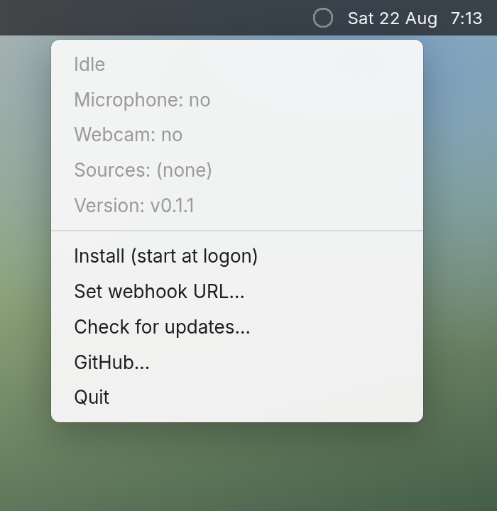
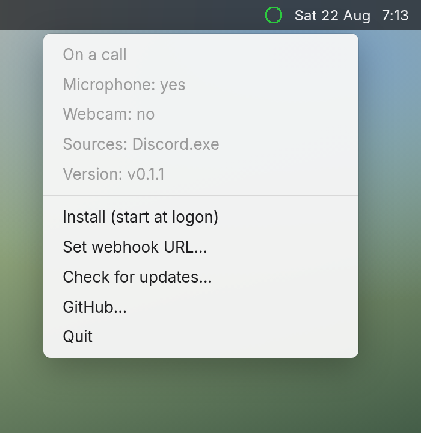

# macOS

call-detect is a menu-bar extra. Click the ring for the same menu as [Windows](../README.md#tray-icon) and [Linux](linux.md). Dialogs use the standard AppleScript prompts.

The binary is not an `.app` bundle. Gatekeeper may ask you to open it from Finder the first time.

| Idle | On a call |
|------|-----------|
|  |  |

Same gray / green / red ring: idle, on a call, webhook failed. See the [main README](../README.md#tray-icon).
